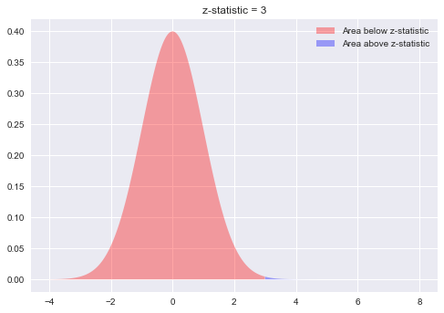
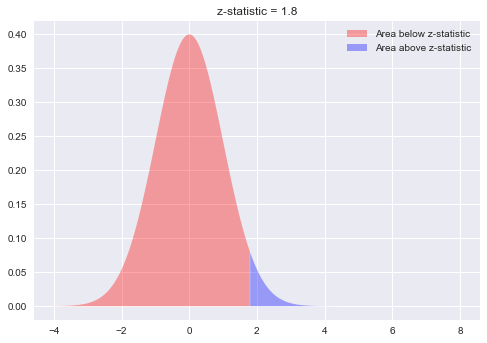

# One-Sample z-test - Lab

## Introduction
In this lab, you'll perform a few quick tests to help you better understand how hypothesis testing works.

## Objectives
You will be able to:

* Explain use cases for a 1-sample z-test
* Set up null and alternative hypotheses
* Use the z-table and scipy methods to acquire the p value for a given z-score
* Calculate and interpret p-value for significance of results

## Exercise 1
A fast-food chain claims that the mean time to order food at their restaurants is 60 seconds, with a standard deviation of 30 seconds. You decide to put this claim to the test and go to one of the restaurants to observe actual waiting times. You take a sample of 36 customers and find that the mean order time was 75 seconds. Does this finding provide enough evidence to contradict the fast food chain's claim of fast service?

Follow the 5 steps shown in previous lesson and use $\alpha$ = 0.05. 

#### STEP 1: State your null and alternative hypotheses

    **ALTERNATIVE HYPOTHESIS:** The sample mean order time for this fast-food restaurant is significantly higher than the population mean.
    
$$\large H_a\text{:   }\mu < \bar{x}$$
    
    **NULL HYPOTHESIS:** There is no significant difference between the sample and population mean order time.
    
    𝐻0: 𝜇≥𝑥

#### STEP 2: Specify a Significance Level (alpha)
    𝛼 = 0.05

    There is a 5 percent chance that we will reject the null hypothesis when it is true.

#### STEP 3: Calculate the test (z) statistic
$$ \large \text{z-statistic} = \dfrac{\bar x - \mu_0}{{\sigma}/{\sqrt{n}}} $$


```python
import scipy.stats as stats
from math import sqrt
x_bar = 75 # sample mean 
n = 36 # number of customers in sample
sigma = 30 # sd of population
mu = 60 # Population mean 

z = (x_bar - mu)/(sigma/sqrt(n))
z
```


    3.0


```python
import numpy as np
import matplotlib.pyplot as plt
%matplotlib inline

plt.style.use('seaborn')
plt.fill_between(x=np.arange(-4,3,0.01),
                 y1= stats.norm.pdf(np.arange(-4,3,0.01)) ,
                 facecolor='red',
                 alpha=0.35,
                 label= 'Area below z-statistic'
                 )

plt.fill_between(x=np.arange(3,8,0.01), 
                 y1= stats.norm.pdf(np.arange(3,8,0.01)) ,
                 facecolor='blue',
                 alpha=0.35, 
                 label= 'Area above z-statistic')
plt.legend()
plt.title ('z-statistic = 3');
```





#### STEP 4: Calculate the p-value


```python
# Calculate the p-value
stats.norm.cdf(z)
```


    0.9986501019683699


```python
# Your solution here
pval = 1 - stats.norm.cdf(z)
pval

# (p = 0.0013498980316301035, z = 3.0)
```


    0.0013498980316301035


The percent area under the curve from a 𝑧 -score of 3 is 99% (using the 𝑧 -table or SciPy calculations), this means that the average order time of the sample set of customers is bigger than 99% of the population. With alpha specified as 0.05, this is greater than 95%, therefore it proves the hypothesis to be significant.

#### STEP 5: Interpret the results in terms of the p-value
"with a confidence level of 95%, we can state that..."


Our p-value (0.0013) is smaller than the alpha of 0.05. 

There is enough evidence to reject the null hypothesis with the given sample, given an alpha of 0.05.

## Exercise 2

25 students complete a preparation program for taking the SAT test.  Here are the SAT scores from the 25 students who completed the program:

``
434 694 457 534 720 400 484 478 610 641 425 636 454 
514 563 370 499 640 501 625 612 471 598 509 531
``

We know that the population average for SAT scores is 500 with a standard deviation of 100.

Are our 25 students’ SAT scores significantly higher than the population's mean score? 

*Note that the SAT preparation program claims that it will increase (and not decrease) the SAT score.  So, you can conduct a one-directional test. (alpha = .05).*

#### State your hypotheses 
    *HA: The sample students SAT scores are significantly higher than the population mean SAT score.
    *H0: There is no significant difference between the sample and population mean SAT scores.


```python
sam_scores = [434, 694, 457, 534, 720, 400, 484, 478, 610, 641, 425, 636, 454, 514, 563, 370, 499, 640, 501, 625, 612, 471, 598, 509, 531]

x_bar = np.mean(sam_scores)

x_bar

```


    536.0


```python
# Give your solution here 

x_bar = 536 # sample mean 
n = 25 # number of customers in sample
sigma = 100 # sd of population
mu = 500 # Population mean 

z = (x_bar - mu)/(sigma/sqrt(n))

s = stats.norm.cdf(z)

p = 1 - stats.norm.cdf(z)
s, p, z

# p = 0.03593031911292577, z = 1.8
```


    (0.9640696808870742, 0.03593031911292577, 1.8)


```python
import numpy as np
import matplotlib.pyplot as plt
%matplotlib inline

plt.style.use('seaborn')
plt.fill_between(x=np.arange(-4,1.8,0.01),
                 y1= stats.norm.pdf(np.arange(-4,1.8,0.01)) ,
                 facecolor='red',
                 alpha=0.35,
                 label= 'Area below z-statistic'
                 )

plt.fill_between(x=np.arange(1.8,8,0.01), 
                 y1= stats.norm.pdf(np.arange(1.8,8,0.01)) ,
                 facecolor='blue',
                 alpha=0.35, 
                 label= 'Area above z-statistic')
plt.legend()
plt.title ('z-statistic = 1.8');
```





#### Interpret the results in terms of the p-value
    The percent area under the curve from a 𝑧 -score of 1.8 is 96%. This means that the average SAT score of the sample set of students is higher than 96% of the population. With alpha specified as 0.05, this is greater than 95%, therefore it proves the hypothesis to be significant.

    Our p-value (0.0359) is smaller than the alpha of 0.05.

    There is enough evidence to reject the null hypothesis with the given sample, given an alpha of 0.05.

## Summary

In this lesson, you conducted a couple of simple tests comparing sample and population means, in an attempt to reject our null hypotheses. This provides you with a strong foundation to move ahead with more advanced tests and approaches later on.
